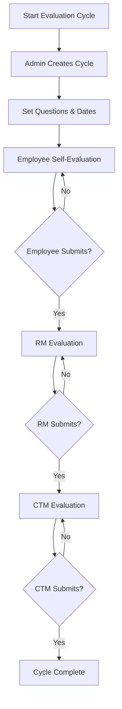
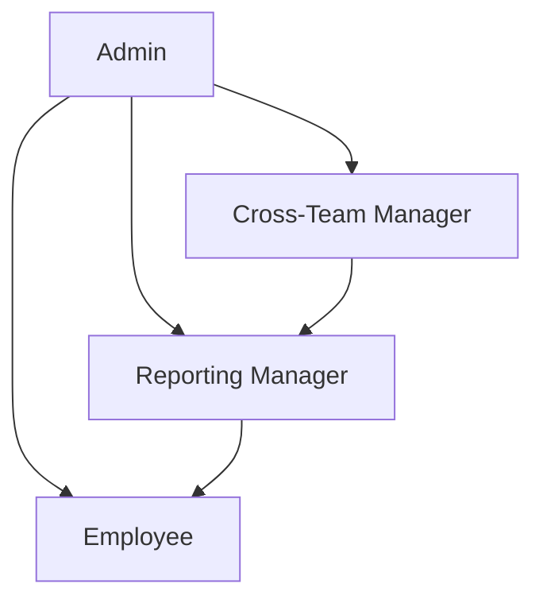
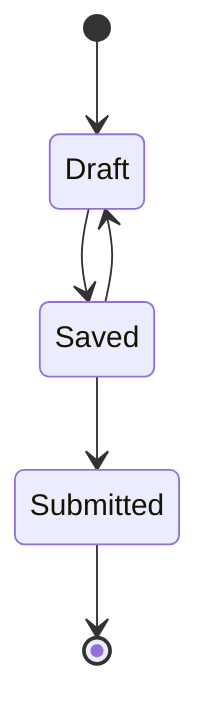
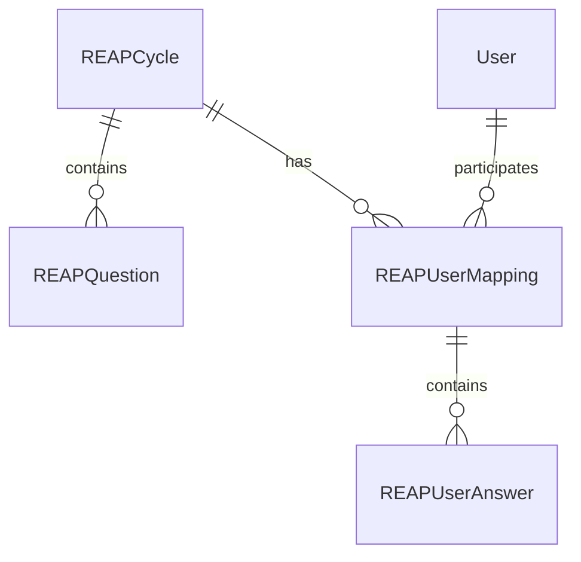
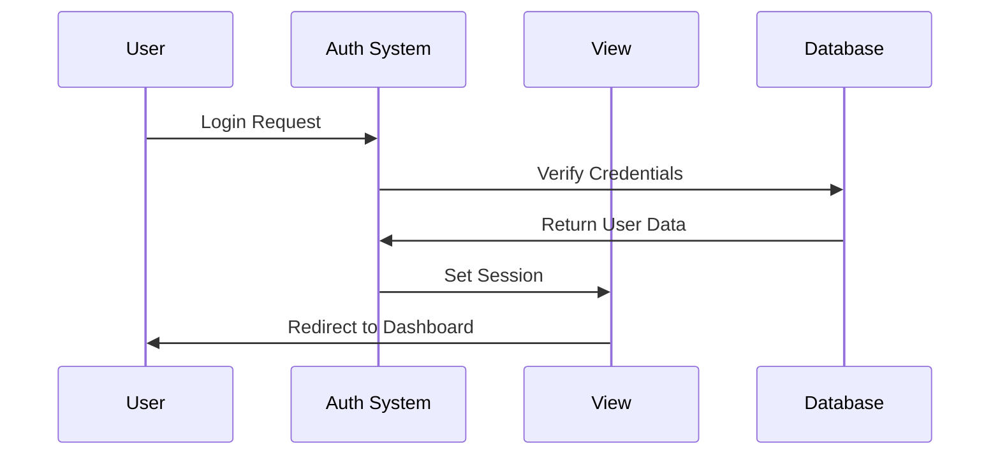
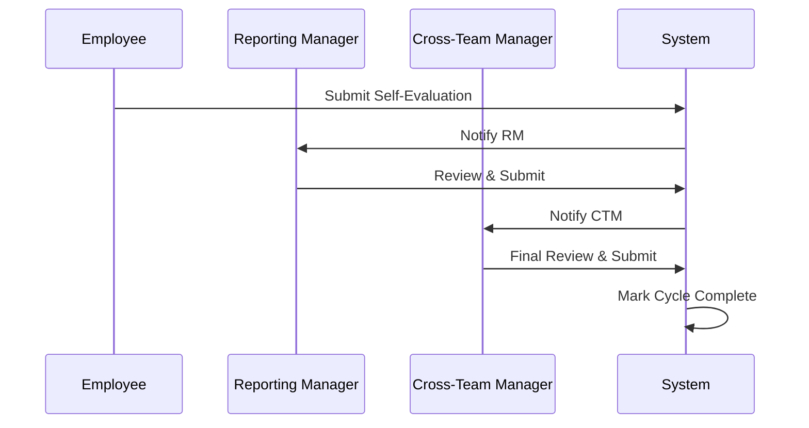
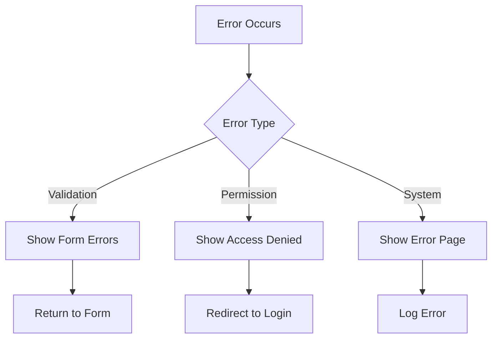

# REAP Application Workflow

## Evaluation Process Flow

## User Role Hierarchy

## Evaluation Form States

## Database Relationships

## Authentication Flow

## Evaluation Submission Process

## Error Handling Flow

